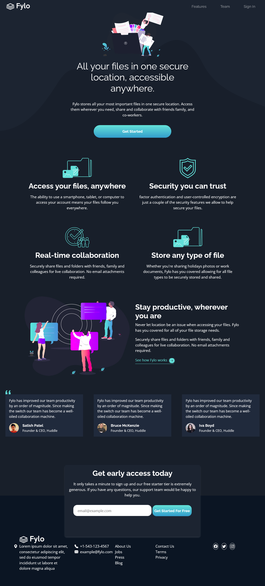

# Frontend Mentor - Fylo dark theme landing page solution

This is a solution to the [Fylo dark theme landing page challenge on Frontend Mentor](https://www.frontendmentor.io/challenges/fylo-dark-theme-landing-page-5ca5f2d21e82137ec91a50fd). Frontend Mentor challenges help you improve your coding skills by building realistic projects.

## Table of contents

- [Frontend Mentor - Fylo dark theme landing page solution](#frontend-mentor---fylo-dark-theme-landing-page-solution)
  - [Table of contents](#table-of-contents)
  - [Overview](#overview)
    - [The challenge](#the-challenge)
    - [Screenshot](#screenshot)
    - [Links](#links)
  - [My process](#my-process)
    - [Built with](#built-with)
    - [What I learned](#what-i-learned)
  - [Author](#author)

## Overview

### The challenge

Users should be able to:

- View the optimal layout for the site depending on their device's screen size
- See hover states for all interactive elements on the page

### Screenshot

### Links

- [Code Source](https://github.com/zougari47/fylo-landing-page)
- [Live Demo](https://zougari47.github.io/fylo-landing-page/)

## My process

### Built with

- HTML
- CSS
- Mobile-first workflow
- [Bootstrap](https://getbootstrap.com/) - CSS framework
- JavaScript regular expression

### What I learned

I practice regular expression JS, and more bootstrap.

## Author

- CodePen - [@zougari47](https://codepen.io/zougari47)
- Frontend Mentor - [@zougari47](https://www.frontendmentor.io/profile/zougari47)
- Twitter - [@zougari47](https://www.twitter.com/zougari47)
